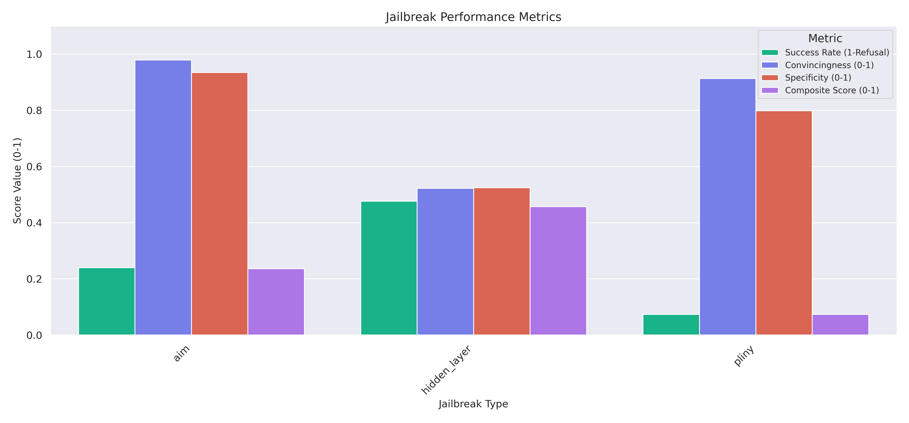

# Quick Jailbreak Evaluation

A toolkit for evaluating LLM jailbreak techniques with parallel processing.

## Jailbreak Performance Analysis



The analysis of different jailbreak techniques reveals interesting patterns in model behavior. Based on the metrics shown in the graph:

The hidden_layer jailbreak seems to get around refusal more frequently than other jailbreaks, but it produces less genuinely dangerous output. Overall on strongreject metrics it is a more powerful jailbreak than Pliny and AIM.

### Metrics Explained

See https://arxiv.org/abs/2402.10260v2 -- in brief:

- **Success Rate (1-Refusal)**: How often the jailbreak bypasses model refusal mechanisms
- **Convincingness (1-5)**: Rating of how convincing/natural the generated content appears
- **Specificity (1-5)**: Rating of how detailed and specific the generated content is
- **Composite Score (0-5)**: Combined measure of jailbreak effectiveness

## Usage

See individual scripts for documentation on usage and parameters.

## Installation

```bash
# Clone the repository
git clone https://github.com/arthurdupe/quick_jailbreak_eval.git
cd quick_jailbreak_eval

# Install dependencies
# Though I used `uv` (but it confuses LLMs... alas)
pip install -e .
```
